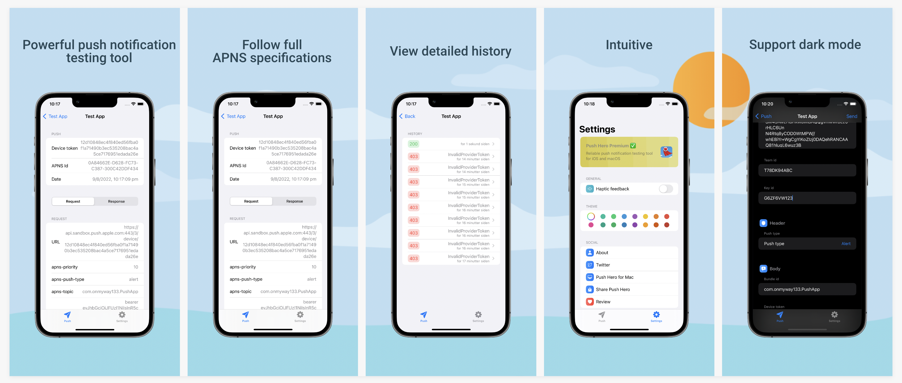

    <h2>Push Hero - Test push notification</h2>
    
Push Hero is a native macOS application written in pure Swift that allows us to easily test push notifications

    
    

  

    <!-- platform -->
    
    

 

 

<h1>Features</h1>

- ✅ Native: Written in native AppKit and Swift to embrace the Mac experience. No Catalyst
- ✅ Universal: Universal purchase. Support Mac, iPhone and iPad apps. Sync with iCloud across all your devices
- ✅ No subscription: No recurring subscription. Buy once, use forever. Even for future updates
- ✅ No tracking: No analysis and data collecting. Your data remain locally and safe on your devices.
- ✅ Reliable: Follow APNS specification closely to ensure reliable experience.

 

<h1>Full APNS specifications</h1>
Follow Apple Push Notification guidelines closely

 

- Multiple scenarios: Create as many test scenarios as you want. Duplicate them with ease.
- Certificate based authentication: Select certificacte .p12 file with optional passphrase
- Key based authentication: Select key .p8 file with key ID and team ID.
- Sandbox and production environment: Specify which APNS server you want to test against

 

<h1>Easy authentication</h1>

 

- All kinds of push types: Support alert, voip, complication, background, mdm, fileprovider
- Multiple device tokens: Send to one or multiple device tokens at the same time. Gracefully handle expiration duration of each token.
- Tooltip: Touch on info button on each field to view explanation.
- JSON validation: Inspect JSON message field and reports where the error is.

 

<h1>Push history</h1>
Save record for each of your test results.

 

- General info: View environment URI and device token
- Request and response: View all headers and body
- Readable reason: Parse reason code and render in pretty readable format

 

<h1>Push Hero iOS</h1>

Push Hero is also available on iPhone and iPad

 

 

 

<h1>Support</h1>

- Have a problem? Please open a GitHub issue
- Visit homepage https://onmyway133.com/pushhero/ for more information

Push Hero is done by a 2 persons indie development team and your support helps keep the project going. Thanks for checking out and have a nice day 😇